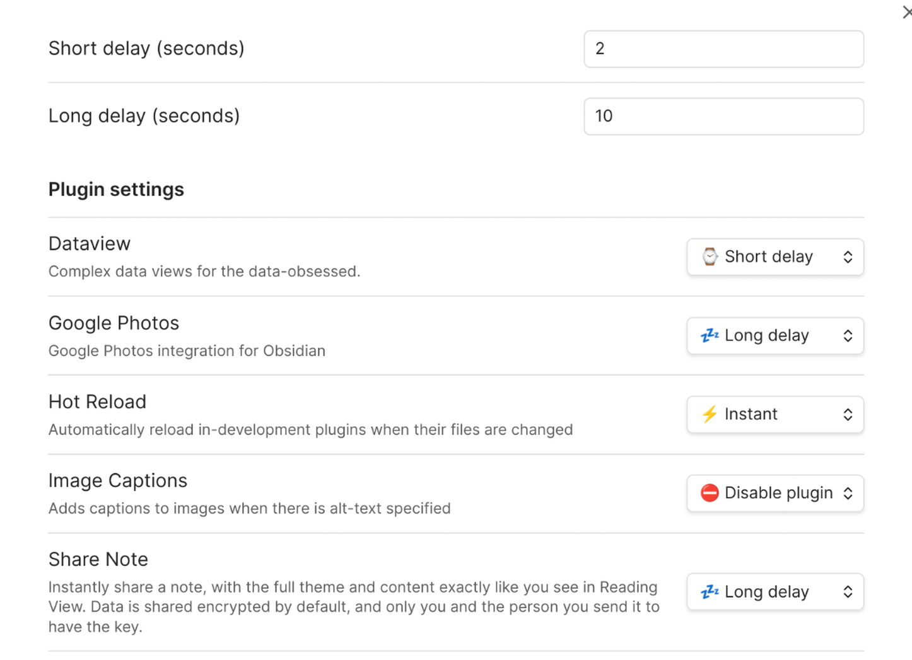

# Lazy Plugin Loader for Obsidian

Load plugins with a delay on Obsidian startup, so that you can get your app startup down into the sub-second loading time.

**Important note #1**: It may take up to 2 restarts of Obsidian to see the full speed increase, if it's the first time you're using the plugin. This will only be an issue on the first install.

**Important note #2**: There is no way for this plugin to know if you've manaully disabled or enabled a plugin. If you want disabling a plugin to persist through an Obsidian restart, make sure you disable it inside Lazy Loader's settings page, rather than simply disabling the plugin in Obsidian's plugins page.

- [Obsidian forum discussion thread](https://forum.obsidian.md/t/87627).

